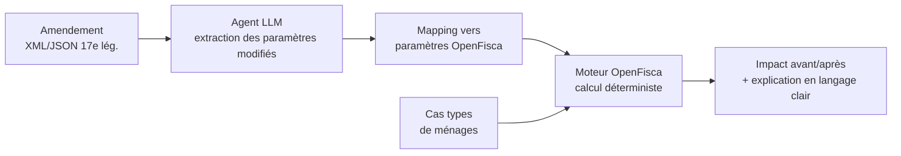

# QuelImpact
 
> Un amendement fiscal change un seuil ou un taux. Et concrètement, ça change quoi pour mon foyer ?
 
Outil citoyen qui traduit un amendement socio-fiscal en impact chiffré sur des ménages réels, construit pour le hackathon *« Le parcours de la loi : vers une IA de confiance »* de l'Assemblée nationale (3-4 juillet 2026).
 
## Le problème
 
Quand un amendement modifie un seuil, un taux ou un barème socio-fiscal, le texte est écrit en langage juridique et ne dit jamais ce que ça implique pour les gens. Des millions de Français sont concernés sans pouvoir évaluer l'effet sur leur situation. L'information existe, elle est juste illisible.
 
## La solution
 
Un pipeline en trois temps :
 
1. **Lecture** — un agent lit l'amendement (données de la 17e législature) et repère les paramètres socio-fiscaux modifiés.
2. **Mapping** — il relie ces changements aux paramètres correspondants dans OpenFisca.
3. **Simulation** — le moteur OpenFisca, déterministe et officiel, calcule l'impact sur des cas types de ménages (célibataire au SMIC, couple avec deux enfants, retraité, etc.).
Une interface affiche le résultat avant/après et l'explique en langage clair.
 
## Pourquoi c'est une IA de confiance
 
C'est le cœur du projet. **L'IA ne produit aucun chiffre.** Elle comprend le texte et l'explique, point. C'est OpenFisca, un moteur de règles officiel et reproductible, qui garantit le calcul.
 
En séparant la compréhension du langage du calcul réglementaire, on rend toute hallucination de montant structurellement impossible. Le citoyen peut remonter de chaque chiffre affiché jusqu'au paramètre légal qui le produit.
 
## Architecture
 

 
## Stack
 
- **Calcul** : Python, `openfisca-france`, `openfisca-core`
- **Agent / extraction** : LLM via API (clé à apporter, l'AN n'en fournit pas)
- **Données** : amendements de la 17e législature (open data AN), paramètres OpenFisca (YAML)
- **Front** : interface web légère (Streamlit pour aller vite, ou React si le temps le permet)
## Périmètre du hackathon (24h)
 
Pour livrer une démo qui tourne plutôt qu'une coquille vide :
 
- On se limite aux amendements de type **changement de taux ou de seuil**.
- On pré-sélectionne **2 ou 3 amendements réels** de la 17e législature.
- On démontre le **pipeline complet de bout en bout** sur ces cas.
Le reste (généralisation à d'autres types d'amendements, plus de cas types) est explicitement hors scope pour la démo.
 
## Ressources
 
- Amendements 17e législature : https://data.assemblee-nationale.fr/travaux-parlementaires/amendements/tous-les-amendements
- Paramètres OpenFisca : https://github.com/openfisca/openfisca-france/tree/master/openfisca_france/parameters
## Statut
 
En préparation pour le hackathon. Contributeurs bienvenus, surtout côté OpenFisca et front.
