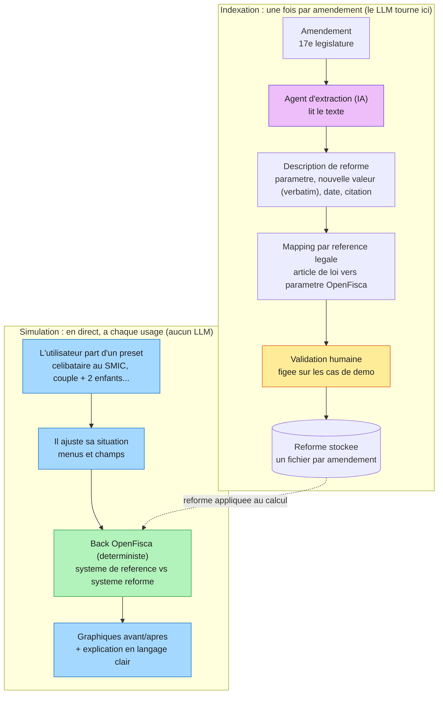

# QuelImpact

> Un amendement fiscal change un seuil ou un taux. Et concrètement, ça change quoi pour mon foyer ?

Outil citoyen qui traduit un amendement socio-fiscal en impact chiffré et visuel sur la situation réelle de l'utilisateur. Construit pour le hackathon « Le parcours de la loi : vers une IA de confiance » de l'Assemblée nationale (3 et 4 juillet 2026).

## Le problème

Quand un amendement modifie un seuil, un taux ou un barème socio-fiscal, le texte est écrit en langage juridique et ne dit jamais ce que ça implique pour les gens. Des millions de Français sont concernés sans pouvoir évaluer l'effet sur leur situation. L'information existe, elle est juste illisible.

## La solution

L'utilisateur part d'un profil proche du sien, l'ajuste à sa situation, et voit en direct l'effet de l'amendement sur son foyer. Deux temps bien séparés :

1. **Indexation (en amont, une fois par amendement).** Un agent lit l'amendement (données de la 17e législature), identifie le changement socio-fiscal et l'article de loi visé, et produit une **description de réforme** : quel paramètre OpenFisca change, vers quelle nouvelle valeur, à quelle date, avec la citation du texte source. C'est le seul moment où l'IA intervient.

2. **Simulation (en direct, à chaque usage).** L'utilisateur choisit un preset (célibataire au SMIC, couple avec deux enfants, retraité), ajuste sa situation via des menus et des champs, et OpenFisca calcule l'impact avant/après sur son foyer, instantanément. L'IA ne tourne pas ici.

La sortie met en avant le revenu disponible du foyer (ce qu'il reste au foyer une fois impôts et prestations pris en compte), et le cas échéant la variable directement touchée par l'amendement. Le tout en graphiques avant/après et en langage clair.

## Pourquoi c'est une IA de confiance

C'est le cœur du projet, et il tient sur trois garanties vérifiables :

- **OpenFisca garantit le calcul.** L'IA ne produit aucun chiffre. Tous les montants viennent d'un moteur de règles officiel, déterministe et reproductible.
- **L'humain garantit le mapping.** Sur les cas de la démo, le lien entre l'amendement et le paramètre OpenFisca est validé puis figé avant toute mise en ligne.
- **La citation garantit la traçabilité.** Chaque résultat renvoie au paramètre légal et au texte source qui le produit.

Point clé de l'architecture de confiance : **le LLM ne voit jamais la situation de l'utilisateur et ne touche jamais au calcul.** Il produit une seule fois, en amont, une description de la modification légale. Le calcul en direct est 100% OpenFisca. Une même situation face à un même amendement donne donc toujours le même résultat.

## Architecture

Le principe directeur : **le LLM est appelé une seule fois par amendement, à l'indexation, jamais pendant que les gens utilisent l'outil.** Ça protège la clé API (aucun visiteur ne peut la solliciter), ça garantit la reproductibilité, et ça rend la démo sûre puisque rien de non déterministe ne tourne en direct devant le jury.

### L'amendement est encodé comme une réforme OpenFisca

Ce n'est pas du bricolage maison : ce que fait l'outil correspond exactement à une **réforme paramétrique** OpenFisca. Le moteur sait nativement prendre son système de référence, appliquer une modification de paramètre (`Reform` / `modify_parameters`) et produire un système réformé, sans altérer la référence.

Le calcul avant/après, c'est donc la même situation utilisateur passée dans le système **de référence** (avant) et dans le système **réformé** (après). L'écart est l'impact de l'amendement sur ce foyer. On ne réimplémente pas la logique de la réforme, on la déclare, OpenFisca fait le reste. Cela renforce le pitch : l'amendement devient une réforme officielle encodée, pas une approximation.

### Trois composants

| Composant | Rôle | Techno |
|---|---|---|
| **Front** | Presets, formulaire de situation, graphiques avant/après, explication citoyenne. Appelle le back à chaque ajustement | React + Vite + TypeScript, Tailwind, Recharts |
| **Back** | `/index` (admin, appelle le LLM une fois, produit la réforme) et `/simulate` (public, OpenFisca calcule en direct). Aucun LLM dans `/simulate` | Python + FastAPI, conteneurisé (Docker) |
| **Calcul** | Réforme paramétrique, calcul déterministe référence vs réformé | `openfisca-france`, `openfisca-core`, exposé via le MCP OpenFisca de l'équipe |

### Le mapping, point technique central

C'est le vrai nerf du projet. **Un amendement n'indique jamais quel paramètre OpenFisca il modifie** : il modifie un article de loi, en langage juridique. C'est donc à l'agent de faire le pont.

Pour ne pas laisser l'IA deviner, on s'ancre sur la **référence légale**. Les paramètres et variables OpenFisca portent un champ `reference` dans leurs métadonnées, qui pointe vers le texte de loi. L'agent extrait l'article visé par l'amendement, et on recherche les paramètres dont la référence pointe vers cet article. Le lien est vérifiable, pas intuité.

Avec l'aide probable du MCP pour que l'agent puisse explorer OpenFisca

## L'expérience : presets personnalisables

Pour tenir la promesse "mon foyer" sans tomber dans l'outil d'expert, on évite la page blanche. Les cas types ne sont pas des résultats figés, ce sont des **points de départ** : l'utilisateur clique sur un profil proche du sien, le formulaire se pré-remplit, et il ajuste ce qu'il veut. Le résultat se recalcule en direct à chaque changement.

Les entrées restent volontairement minimales pour la démo : situation familiale (seul ou en couple), nombre d'enfants, revenu du foyer. Trois ou quatre champs, pas plus. OpenFisca-france a un modèle d'entités non trivial (individus, familles, foyers fiscaux, ménages) : traduire ces entrées en une situation valide est un point à cadrer avec les experts OpenFisca de l'équipe, et une raison de plus de garder peu de champs.

## Périmètre du hackathon (24h)

Pour livrer une démo qui tourne plutôt qu'une coquille vide :

- On se limite aux amendements de type changement de taux ou de seuil.
- On pré-sélectionne 2 ou 3 amendements réels de la 17e législature, mapping validé et figé.
- On démontre le pipeline complet de bout en bout : indexation d'un amendement, puis simulation en direct sur une situation personnalisée.

## Ressources

- Amendements 17e législature : https://data.assemblee-nationale.fr/travaux-parlementaires/amendements/tous-les-amendements
- Paramètres OpenFisca : https://github.com/openfisca/openfisca-france/tree/master/openfisca_france/parameters

## Équipe

- **Théo** : porteur du défi, développeur IA (GENIAL). Orchestration de l'agent, mapping, front citoyen, expérience grand public.
- **Mathieu** : Ingénieur IA au Sénat , pertience agents , architecture 
- **Benoît** (LexImpact) : MCP OpenFisca, fiabilité du calcul, expertise socio-fiscale.
- **Sylvain** (IPP) : expertise OpenFisca (présent le vendredi).
- Renforts Bienvenus

L'exposition d'OpenFisca à l'agent via un serveur MCP fait partie des pistes d'architecture envisagées, à confirmer pendant le hackathon. Les contributeurs intéressés par le MCP, l'orchestration d'agents, le front citoyen ou l'expertise OpenFisca sont les bienvenus.

## Statut

En préparation pour le hackathon des 3 et 4 juillet 2026.
